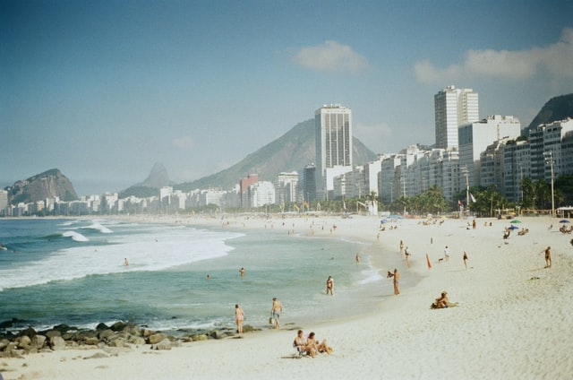
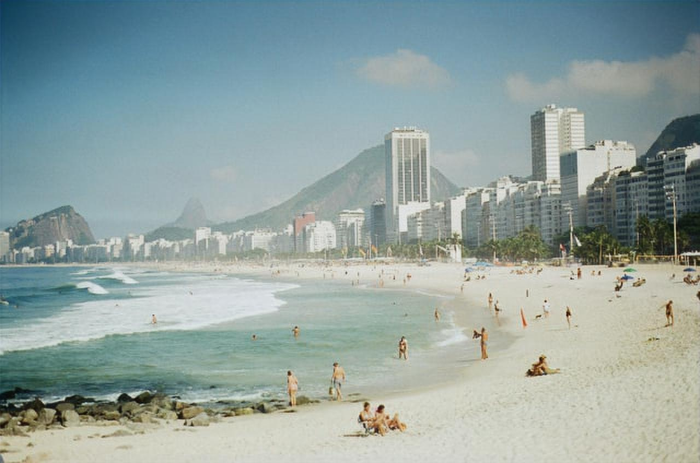
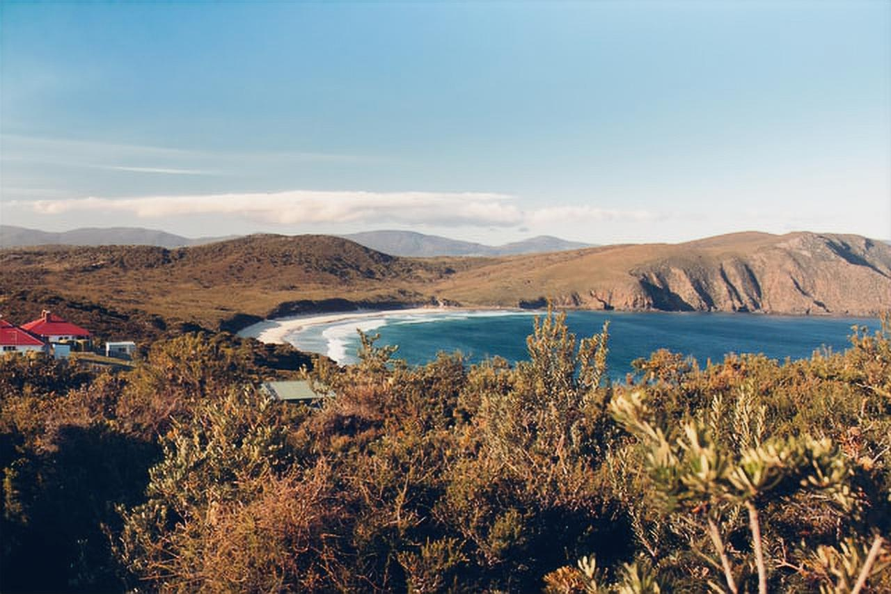

# SRGAN

## Reimplement SRGAN paper 

[](https://colab.research.google.com/drive/1WhSJfCwBkBlSS4KEA1HKtGIp9gF2HcGL?usp=sharing)


## Dataset used:

I have used the DIV2K Dataset for High Quality images to train the Generator and Discriminator Models to train. The Dataset has 1000 2K resolution images divided into: 800 images for training, 100 images for validation, 100 images for testing

Download train images: DIV2KTrain(http://data.vision.ee.ethz.ch/cvl/DIV2K/DIV2K_train_HR.zip)

Download Validation images: DIV2KTrain(http://data.vision.ee.ethz.ch/cvl/DIV2K/DIV2K_valid_HR.zip)

## Training:
The models have been trained for 50 epochs with a batch size of 32 images for 2X resolution of original image
```
Statestics of the model for 50 epochs are:
PSNR: 28.5196 dB
SSIM: 0.8826
```
## Result:

Result for Super Resolution with UPSCALE_FACTOR = 2

ORIGINAL IMAGE | UPSCALED IMAGE

|  

|  

|  
